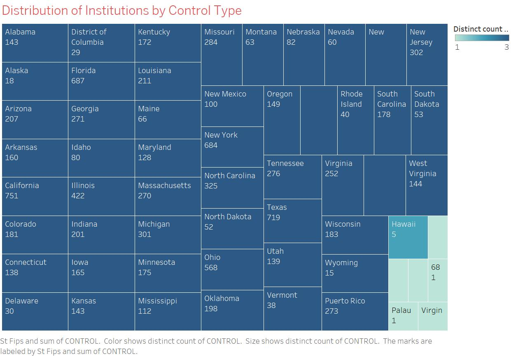

# Exploring-Degrees-Diversity-and-Control-In-U.S.-Colleges (Using Tablue)
Analyzed U.S. college data to study institutional control types, degree distributions, and racial diversity among undergraduate students. Performed extensive data cleaning (reducing columns from 1,986 to 12) and utilized data visualization to uncover trends, providing actionable insights for understanding patterns in higher education.

Today, I’m excited to share insights from my project titled "Exploring Degrees, Diversity, and Control in U.S. Colleges." This work delves into the composition and diversity of U.S. colleges, aiming to shed light on patterns that are both significant and informative.
Data Cleaning: Let’s begin with the foundation—our dataset. Initially, we started with 6,807 rows and a staggering 1,986 columns. After meticulous data cleaning, we narrowed it down to a much more manageable 5,513 rows and 12 columns. The cleaning process involved removing all missing and null values as well as filtering out invalid records, ensuring the dataset's reliability for analysis. This step was crucial to maintain the integrity of our results.

________________________________________
Question 1: How are institutions distributed based on their control type (public, private nonprofit, private for-profit)?
•	This question aims to explore the composition of institutions by their administrative control type.
________________________________________
Question 2: What is the most common undergraduate degree type awarded across institutions?
•	This will analyze which degrees (Certificate, Associate, Bachelor’s, Graduate, or Non-degree) are predominantly awarded.
________________________________________
Question 3: What is the racial diversity among undergraduate students across all institutions?
•	Investigate the proportions of undergraduate students by race (e.g., White, Black, Hispanic, Asian, etc.).
________________________________________
Question 4: How do the proportions of Black undergraduate students differ across public institutions?
Identify the states with the most educational institutions and visualize their distribution.
________________________________________
Question 5: How do the proportions of white undergraduate students differ across public institutions?
•	Analyze the distribution of white undergraduate students (UGDS_WHITE) within public institutions (CONTROL = 1).
Visualizations and Findings: Visualization was at the heart of this project. By transforming raw data into graphs and charts, we made complex patterns accessible and understandable. For example:
•	Institution Control: We observed how public, private nonprofit, and private for-profit institutions are distributed nationwide, revealing clear distinctions in their prevalence.
•	Degree Types: Undergraduate degree awards displayed a pattern, highlighting the most common qualifications students pursue.
•	Racial Diversity: Our analysis uncovered the extent of representation across different racial groups.
•	When focusing on public institutions, we saw notable variations in the proportions of both Black and White undergraduate students, emphasizing regional or systemic differences.
Conclusion: This project underscores the power of data visualization. Complex datasets, when visualized effectively, can illuminate trends and patterns that would otherwise remain hidden. It simplifies decision-making and enriches storytelling, turning raw data into actionable insights.
Final Thoughts: In conclusion, this exploration provides a window into the diversity and degree distribution across U.S. colleges, highlighting not just numbers but narratives within the education system. It’s a testament to the transformative power of data analytics.
Thank you for your attention, and I look forward to any questions you might have!

